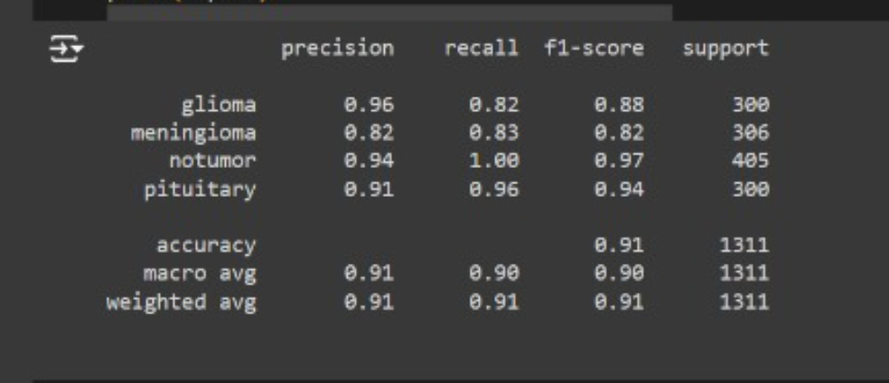
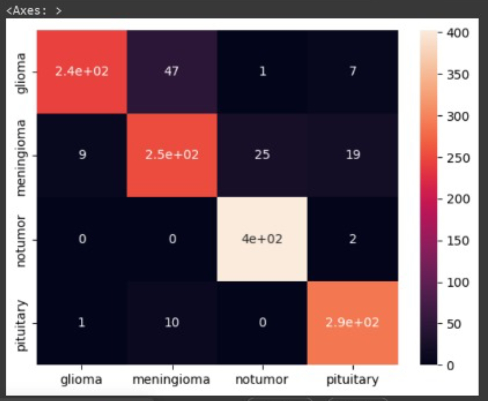

# Brain Tumor Detection 🧠


## Introduction

Welcome to the Brain Detection ML project documentation. In this project we employed the Convolutional Neural Networks (CNN) Model, to detect brain tumors early and accurately. Brain tumors, categorized as benign or malignant, pose significant health risks. Our project employs machine learning techniques to identify these tumors with precision, making it a valuable resource for medical professionals and individuals concerned about neurological health.

## About this Project


In our project, we've focused on training a model to detect brain tumors using a dataset consisting of four main categories: Glioma, Meningioma, Pituitary, and a category denoting images with no tumors. 

The model was trained on 5,700 dataset and we on tested 1,300 dataset, that is different images of MRI scans. With some containing brain tumors and some without. 

We trained our model using Convolutional Neural Network (CNN) in TensorFlow. We utilizing the transfer learning method, transfer learning involves leveraging a pre-trained model and fine-tuning it for our specific task.

After training and evaluating our model's performance, we deployed it as a one-page web application using Streamlit, a Python library known for its simplicity and ease of use in creating interactive web applications.

 This approach allows users to easily upload brain scan images and receive real-time predictions regarding the presence of tumors, facilitating early detection and intervention in brain-related health issue.


### About the data: 📊

The dataset contains 4 folders:

### Link to Dataset 🔗
[Dataset](https://www.kaggle.com/datasets/masoudnickparvar/brain-tumor-mri-dataset)

## Library Requirements 📚

🐍 Python 3 is required. 

We'll be using the following libraries to complete our classification problem:

**Numpy** - NumPy is a powerful library for numerical computing in Python, providing support for large, multi-dimensional arrays and matrices, along with a collection of mathematical functions to operate on these arrays.

**OS** - os module to perform tasks such as navigating the file system, working with files and directories, and accessing environment variables.

**Pandas** - To create DataFrame, CSV files, etc. It provides data structures and functions for working with structured data, such as data frames, which are similar to tables in a database or spreadsheet. 

**Tensorflow** - TensorFlow provides tools and libraries for building and training machine learning models.

**Scikit-Learn** - Machine learning framework. We have used this for evaluating our Classifier and for cross-validation split

**Streamlit** - Streamlit is a Python library that simplifies the process of building interactive web applications for machine learning and data science projects. With Streamlit, you can create user-friendly interfaces by writing simple Python scripts

**Google Colab Drive** - To mount Google Drive so we can perform storage and loading operations using it (Only available on Google Colab)


## Installation

Install the required libraries on your computer using the pip package manager.

Install streamlit

```bash
  pip install tensorflow
   pip install streamlit

```

## Deployment

 ### To run streasmlit

```bash
  streamlit run file_name.py


```
## Steps to Create the Model
   1. Importing Essential Libraries: :white_check_mark:
  
  ```python
import tensorflow as tf
import tensorflow_hub as hub
import numpy as np
import pandas as pd
import os
from IPython.display import Image
from sklearn.model_selection import train_test_split
from sklearn.metrics import accuracy_score
print("Tf version:", tf.__version__)

```
   
  2. Loading the images and labels from directories :white_check_mark:
  
  ```python
label = []
image_path = []

for dirname,root ,f_name in os.walk("/content/Training"):
  for filename in f_name:
    label.append(os.path.basename(dirname))
    image_path.append(os.path.join(dirname,filename))

```

   3. converting the array to numpy and checking if data and label match:white_check_mark:
  
  ```python

#it checks if the number of labels is equal to the number of image paths
#this code helps verify the consistency of the dataset before proceeding with further processing or analysis.
#Changing the labels to numpy arrays

label = np.array(label)

if len(label) == len(image_path):
  print("they are equal, carry on")
else:
  print("this isnt equal oo")
```
   4. converting the array to numpy and checking if data and label match:white_check_mark:
  
  ```python
#This code finds the unique label values in the #dataset. It uses NumPy's np.unique() function to #identify all the distinct labels 

uniq_label = np.unique(label)
uniq_label
```
   5. Converting the label to bolean list where it prints true for the type and false for rest :white_check_mark:
  
  ```python

boll_label = [ label == uniq_label for label in label]
boll_label[2000]

```
   6. Converting the label to bolean list where it prints true for the type and false for rest :white_check_mark:
  ```python

boll_label = [ label == uniq_label for label in label]
boll_label[2000]

```
7. spliting the data into train, val and test. The splitting process ensures that you have separate datasets for training, validation, and testing your machine learning model.:white_check_mark:
  
  ```python

boll_label = [ label == uniq_label for label in label]
boll_label[2000]

```

8.  checking the shape of the images before resizing.:white_check_mark:
  
  ```python
#To fit a uniform size the computer understands

import matplotlib.pyplot as plt
from matplotlib.pyplot import imread

image = plt.imread(image_path[0])
image.shape

```

 9.  We use the next() to break the tense into image and label
.:white_check_mark:
  
  ```python

train_img,train_label = next(train_data.as_numpy_iterator())
show_img(train_img,train_label)

```
10.  Importing the model from Keras using Tensorflow. We use tranfer learning where the model is pre-trained
.:white_check_mark:
  
  ```python
from tensorflow import keras
input_shape = [ None, img_size,img_size, 3]
output_shape = len(uniq_label)

model_url =  "https://tfhub.dev/google/imagenet/mobilenet_v2_130_224/classification/4"

```
11.   ###CREATING THE MODEL
.:white_check_mark:
  
  ```python

def createmodel(input_shape= input_shape, output_shape = output_shape, model_url = model_url):
  model = keras.Sequential([
      hub.KerasLayer(model_url),
      keras.layers.Dense(units = output_shape,
                         activation = "softmax")
  ])

  model.compile(
      loss = keras.losses.CategoricalCrossentropy(),
      optimizer = keras.optimizers.Adam(),
      metrics = ["accuracy"]
  )

  model.build(input_shape)

  return model

```

12. Model Summary
.:white_check_mark:
  
  ```python

model = createmodel()
model.summary()

```


## Usage/Examples

```python
import tensorflow as tf
import tensorflow_hub as hub
import numpy as np
import pandas as pd
import os
from IPython.display import Image
from sklearn.model_selection import train_test_split
from sklearn.metrics import accuracy_score
print("Tf version:", tf.__version__)
```


## Classification Report
### precision recall f1-score support



  - [x] glioma 0.96 0.82 0.88 300
  - [x] meningioma 0.82 0.83 0.82 306
  - [x] notumor 0.94 1.00 0.97 405
  - [x] pituitary 0.91 0.96 0.94 300
  - [x] accuracy 0.91 1311
  - [x] macro avg 0.91 0.90 0.90 1311
- [x] weighted avg 0.91 0.91 0.91 1311


## Results

|     ...... | train set| Test set     |
| :---        |    :----:   |          ---: |
| Accuracy     | 96%      | 90  |
| F1 Score   | 0.96        | 0.90      |

## Confusion Matrix

The Confusion Matrix shows how many correct predictions the model makes.




## Streamlit Webapp Usage (Features)

- Browse file to show image
- Upload Image
- Show image
- Predict
- Read more on tumor

## Limitations

 Currently, the app indicates "no tumor detected" even when a user uploads a random image. However, when there is a brain tumor present, the app accurately identifies it, and when there is no brain tumor it detects no tumor present and tells the user. We are yet to develop the code to recognize when a random image is uploaded and doesn't depict a brain tumor.


